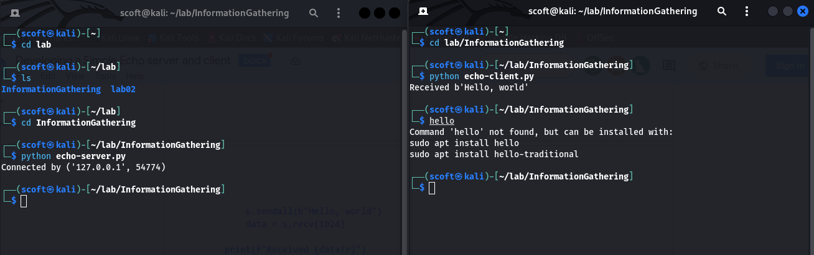

# InformationGathering
Information Gathering Techiques

# To perform information gathering techniques

# AIM:

To perform information gathering techniques using kali linux 

## STEPS:

### Step 1:

Install kali linux either in partition or virtual box or in live mode

### Step 2:

Investigate on the various categories of tools as follows:

### Step 3:
Open terminal/browser and try execute necessary commands/use url to perform information gathering
 ### Program:
 ###Server code
### echo-server.py

```py
import socket


HOST = "127.0.0.1"  # Standard loopback interface address (localhost)
PORT = 65432  # Port to listen on (non-privileged ports are > 1023)


with socket.socket(socket.AF_INET, socket.SOCK_STREAM) as s:
    s.bind((HOST, PORT))
    s.listen()
    conn, addr = s.accept()
    with conn:
        print(f"Connected by {addr}")
        while True:
            data = conn.recv(1024)
            if not data:
                break
            conn.sendall(data)
Client Code:
# echo-client.py


import socket


HOST = "127.0.0.1"  # The server's hostname or IP address

PORT = 65432  # The port used by the server


with socket.socket(socket.AF_INET, socket.

SOCK_STREAM) as s:
    s.connect((HOST, PORT))
    s.sendall(b"Hello, world")
    data = s.recv(1024)


print(f"Received {data!r}")
```


## OUTPUT:




## RESULT:
The information gathering techniques tools/procedure were  identified successfully
